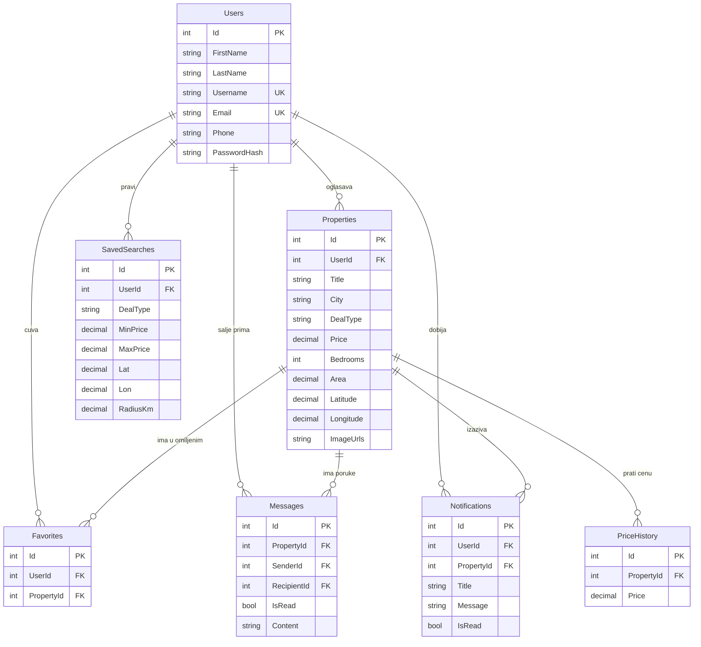

# House Cottage Finder

House Cottage Finder je full-stack web aplikacija za kupovinu i izdavanje nekretnina (kuće, vikendice, stanovi) na tržištu Srbije. Korisnik pretražuje oglase preko mapе sa filterima i radijusom, upoređuje nekretnine, čuva omiljene i sačuvane pretrage, a kupac i prodavac komuniciraju uživo preko chata. Svaki registrovani korisnik može i da oglašava nekretnine.

## Funkcionalnosti

- **Registracija i prijava**: JWT autentikacija (token se čuva u HttpOnly kolačiću `HcfAuth`), lozinke se čuvaju kao hash, izmena profila i promena lozinke;
- **Pretraga nekretnina**: filteri po tipu posla (prodaja/izdavanje), ceni, broju spavaćih soba, površini i veličini placa;
- **Pretraga po mapi**: Leaflet mapa sa klasterima markera, Geoapify autocomplete za unos lokacije i pretraga u radijusu oko izabrane tačke (Haversine formula);
- **Oglasi**: kreiranje, izmena i brisanje (samo vlasnik), lista `Moji oglasi`, galerija više slika sa lightbox prikazom;
- **Upload slika**: `POST /api/upload` čuva fajlove u `wwwroot/uploads/` (jpg, jpeg, png, webp, gif) sa GUID nazivima;
- **Omiljeni**: dodavanje, uklanjanje i provera da li je nekretnina u omiljenim;
- **Upoređivanje**: poređenje više nekretnina u tabeli (cena, površina, cena po m², sobe, lokacija);
- **Chat u realnom vremenu**: SignalR hub `/hubs/chat` sa sobama po konverzaciji, plus REST za istoriju poruka i niti;
- **Obaveštenja**: generišu se pri novoj poruci i kada se pojavi oglas koji odgovara sačuvanoj pretrazi (uključujući geo-radijus), sa brojačem nepročitanih;
- **Sačuvane pretrage**: čuvanje kompletnog skupa filtera pod imenom i dobijanje obaveštenja pri novom pogodnom oglasu;
- **Statistika tržišta**: pregled po gradovima (broj oglasa, prosečna cena, cena po m², min/maks) i ukupni pregled po tipu posla;
- **Istorija cena**: entitet `PriceHistory` i endpoint `GET /api/properties/{id}/price-history`;
- **Demo podaci**: seeder pri prvom pokretanju kreira tri naloga, osam oglasa, poruke i obaveštenje;
- **Testovi**: 21 Vitest jedinični test i 12 Playwright e2e scenarija.

## Tehnologije

| Sloj | Tehnologije |
| --- | --- |
| Frontend | Angular 21 (standalone komponente, signals), TypeScript 5.9, RxJS |
| Stilovi | Tailwind CSS 4, daisyUI 5 |
| Mapa | Leaflet 1.9, leaflet.markercluster, Geoapify geocoder |
| Backend | C#, .NET 10, ASP.NET Core Minimal API |
| Baza | MySQL 8 (Pomelo EF Core 9) |
| Bezbednost | JWT Bearer, HttpOnly kolačić, PasswordHasher |
| Realno vreme | SignalR (`@microsoft/signalr`) |
| Dokumentacija | Swagger UI (Development) |
| Testiranje | Vitest (`ng test`), Playwright (e2e) |

## Struktura projekta

```text
House-Cottage-Finde/
├── Backend/
│   └── HouseCottageFinder.Api/
│       ├── Data/                  AppDbContext, DemoDataSeeder, seed.sql
│       ├── Endpoints/             Auth, Property, Favorites, Chat, Notification,
│       │                          SavedSearch, Stats, Upload (Minimal API grupe)
│       ├── Hubs/                  ChatHub (SignalR)
│       ├── Models/                User, Property, Favorite, Message, Notification,
│       │                          PriceHistory, SavedSearch, DTO-i
│       ├── Services/              NotificationService (poklapanje sa sačuvanom pretragom)
│       ├── wwwroot/uploads/       otpremljene slike
│       └── Program.cs             DI, JWT, CORS, statički fajlovi, seed
├── Frontend/
│   └── HouseCottageFinder/
│       ├── src/app/pages/         search, listing-details, sell, edit-listing,
│       │                          my-listings, favorites, compare, stats, chat-page,
│       │                          messages, notifications, saved-searches,
│       │                          profile, login, register, about
│       ├── src/app/services/      auth, house, favorites, chat, notification,
│       │                          saved-search, compare, stats, selected-location, carto-basemap
│       ├── src/app/components/    card, chat, map, icon-tag, icon-widget, link
│       ├── e2e/                   Playwright testovi (12 spec fajlova)
│       └── proxy.conf.json        /api, /hubs i /uploads ka backendu
└── README.md
```

## Lokalno pokretanje

### Preduslovi

- [.NET 10 SDK](https://dotnet.microsoft.com/download);
- Node.js 20 ili noviji (npm 11);
- MySQL 8 na `localhost:3306` (korisnik `root`, lozinka `root`).

### 1. Backend

```bash
cd Backend/HouseCottageFinder.Api
dotnet run
```

API radi na **http://localhost:5131**, a Swagger UI na **http://localhost:5131/swagger** (samo u Development okruženju).

> **Napomena:** pri svakom pokretanju baza se briše i ponovo kreira (`EnsureDeleted` + `EnsureCreated`), a demo podaci se poseju iznova. Sve izmene u bazi nestaju pri sledećem startu.

Connection string, JWT parametri (`Jwt:Key`, `Issuer`, `Audience`, `ExpirationMinutes = 1440`) i CORS dozvoljeni origin (`http://localhost:4200`) nalaze se u `appsettings.json`.

### 2. Frontend

U drugom terminalu:

```bash
cd Frontend/HouseCottageFinder
npm install
npm start
```

Aplikacija je dostupna na **http://localhost:4200**. Dev server preko `proxy.conf.json` prosleđuje `/api`, `/hubs` (sa `ws: true`) i `/uploads` na `http://127.0.0.1:5131`.

### Demo nalozi

Nalozi se automatski prave pri prvom pokretanju backenda (`Data/DemoDataSeeder.cs`):

| Uloga | Email | Lozinka |
| --- | --- | --- |
| Vlasnik oglasa | `owner@example.com` | `owner123` |
| Kupac | `alice@example.com` | `alice123` |
| Kupac | `bob@example.com` | `bob123` |

Demo lozinke služe isključivo za lokalno okruženje.

## Pregled API-ja

Zaštićeni endpointi zahtevaju autentikaciju (HttpOnly kolačić ili `Authorization: Bearer <token>`). Token se dobija prijavo/registracijom.

| Metoda | Ruta | JWT | Opis |
| --- | --- | --- | --- |
| POST | `/api/auth/register` | – | registracija |
| POST | `/api/auth/login` | – | prijava, postavlja kolačić |
| POST | `/api/auth/logout` | – | odjava |
| GET | `/api/auth/me`, `/api/auth/profile` | ✔ | podaci o prijavljenom korisniku |
| PUT | `/api/auth/profile` | ✔ | izmena profila i promena lozinke |
| GET | `/api/users/{id}` | ✔ | korisnik po id-ju |
| GET | `/api/properties` | – | filteri + geo pretraga (`lat`, `lon`, `radius`, `dealType`, `minPrice`, `maxPrice`, `minBedrooms`, `maxBedrooms`, `minArea`, `maxArea`, `minPlotSize`, `maxPlotSize`) |
| GET | `/api/properties/{id}` | – | detalji oglasa |
| GET | `/api/properties/{id}/price-history` | – | istorija cena |
| GET | `/api/properties/my` | ✔ | oglasi prijavljenog korisnika |
| POST | `/api/properties` | ✔ | novi oglas (pokreće proveru sačuvanih pretraga) |
| PUT | `/api/properties/{id}` | ✔ | izmena oglasa (samo vlasnik) |
| DELETE | `/api/properties/{id}` | ✔ | brisanje oglasa (samo vlasnik) |
| GET | `/api/favorites` | ✔ | lista omiljenih |
| GET | `/api/favorites/check?propertyId=` | ✔ | da li je u omiljenim |
| POST/DELETE | `/api/favorites/{propertyId}` | ✔ | dodavanje/uklanjanje |
| GET | `/api/chat/threads[?propertyId=]` | ✔ | niti razgovora |
| GET | `/api/chat/messages?propertyId=&withUserId=` | ✔ | istorija poruka |
| POST | `/api/chat/messages` | ✔ | slanje poruke (kreira obaveštenje) |
| GET | `/api/notifications` | ✔ | obaveštenja |
| GET | `/api/notifications/unread-count` | ✔ | broj nepročitanih |
| PUT | `/api/notifications/{id}/read` | – | označi kao pročitano |
| PUT | `/api/notifications/read-all` | ✔ | označi sve kao pročitana |
| GET/POST/DELETE | `/api/saved-searches[/{id}]` | ✔ | sačuvane pretrage |
| GET | `/api/stats/regions` | – | statistika po gradovima |
| GET | `/api/stats/overview` | – | ukupna statistika tržišta |
| POST | `/api/upload` | – | upload slika (`multipart/form-data`) |

### SignalR

Konekcija: `/hubs/chat` (autorizovano). Frontend se pridružuje sobi po konverzaciji:

| Smer | Naziv | Opis |
| --- | --- | --- |
| klijent → server | `JoinConversation(propertyId, otherUserId)` | pridruživanje grupi `conv_{propertyId}_{min}_{max}` |
| klijent → server | `LeaveConversation(...)` | napuštanje grupe |
| server → svi u grupi | `ReceiveMessage` | nova poruka stiže u realnom vremenu |

## Arhitektura baze



Šema se ne vodi migracijama, nego se generiše iz modela pri pokretanju (`EnsureCreated`).

## Testovi

Jedinični testovi (Vitest) i e2e testovi (Playwright) nalaze se u frontendu. Backend trenutno nema test projekat.

```bash
cd Frontend/HouseCottageFinder

# jedinični testovi
npm test

# e2e testovi (aplikacija mora da radi na :4200)
npm run e2e
```

Playwright je podešen na `baseURL http://localhost:4200`, Chromium, headless režim isključen (`playwright.config.ts`). E2e scenariji pokrivaju: `auth`, `navbar`, `search`, `listing-details`, `sell`, `edit-listing`, `my-listings`, `favorites`, `compare`, `chat`, `notifications`, `profile`.

## Poznate napomene

- Baza se resetuje pri svakom pokretanju backenda;
- Geoapify API ključ je hardkodiran u `Frontend/HouseCottageFinder/src/app/app.config.ts`;
- JWT ključ i lozinka baze nalaze se u `appsettings.json` (namena: lokalni razvoj);
- Tri endpointa trenutno nemaju `[Authorize]`: `PUT /api/notifications/{id}/read`, `DELETE /api/saved-searches/{id}` i `POST /api/upload`.

## Autor

**Danil** – [github.com/magzzy124](https://github.com/magzzy124)
